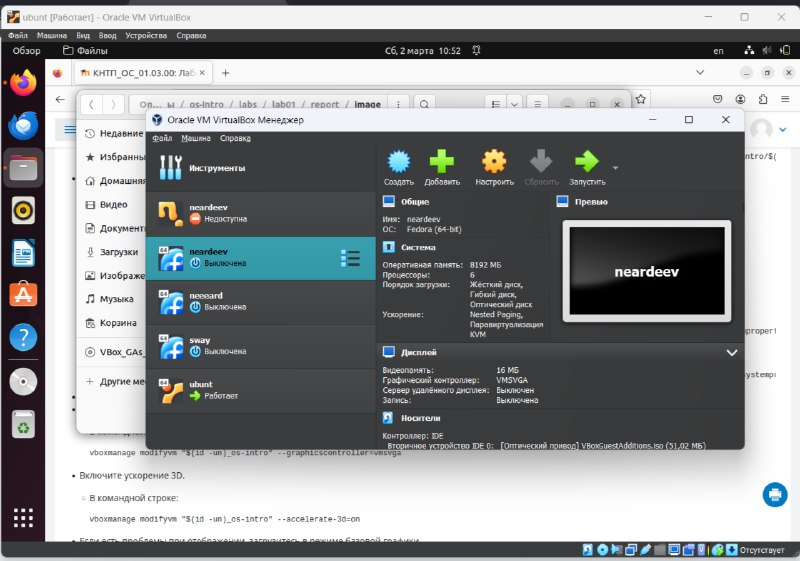
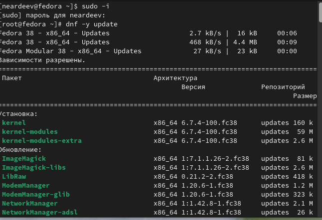
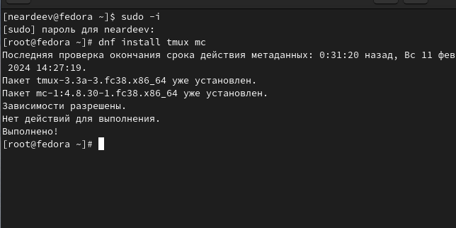
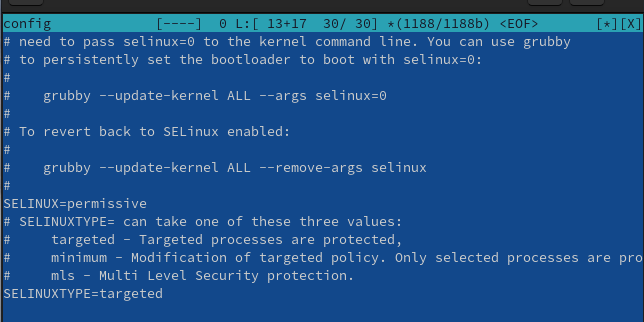
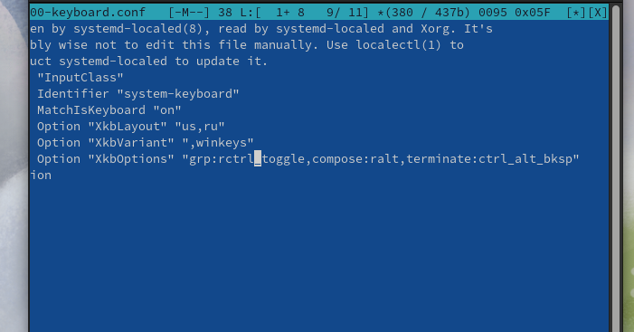
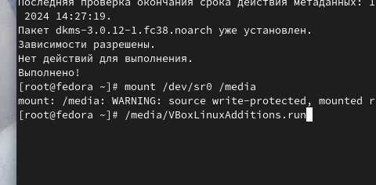
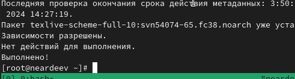
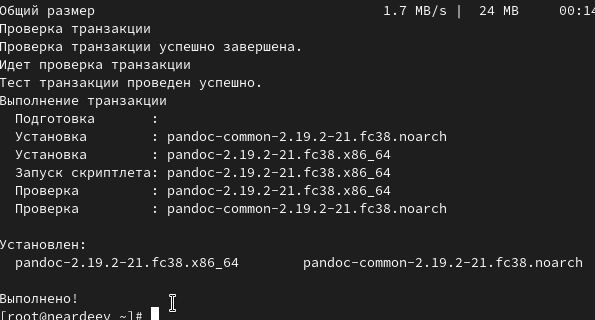

---
## Front matter
lang: ru-RU
title: Структура научной презентации
subtitle: Простейший шаблон
author:
  - Ардеев Н. Е.
institute:
  - Российский университет дружбы народов, Москва, Россия

## i18n babel
babel-lang: russian
babel-otherlangs: english

## Formatting pdf
toc: false
toc-title: Содержание
slide_level: 2
aspectratio: 169
section-titles: true
theme: metropolis
header-includes:
 - \metroset{progressbar=frametitle,sectionpage=progressbar,numbering=fraction}
 - '\makeatletter'
 - '\beamer@ignorenonframefalse'
 - '\makeatother'
---

# Вводная часть

## Объект и предмет исследования

- Виртуальная машина
- OS Linux

## Цели и задачи

- Целью данной работы является приобретение практических навыков установки операционной системы на виртуальную машину, настройки минимально необходимых для дальнейшей работы сервисов.

# Ход работы

## Установим виртуальную машину и загрузим в нее OS Linux

{#fig:001 width=60%}

## Подключим обновления и установим их

{#fig:002 width=60%}

## Подключим tmux и отключим SElinux

{#fig:003 width=30%}

{#fig:004 width=30%}

## Настроим раскладку клавиатуры

{#fig:005 width=60%}

## Подключим образ диска для хостовой ОС

{#fig:006 width=60%}

## Установим pandoc и LaTex

{#fig:007 width=35%}

{#fig:008 width=35%}

# Результаты

## Вывод

 -Успешно установили Linux OS  на  ОВМ  и настроили его 
