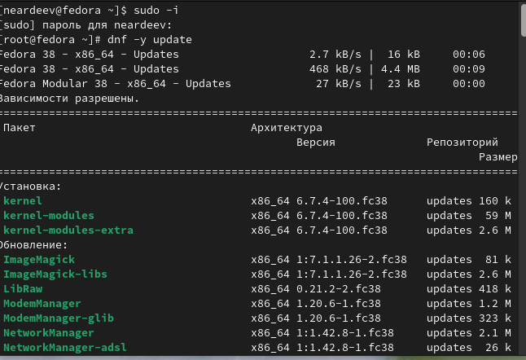
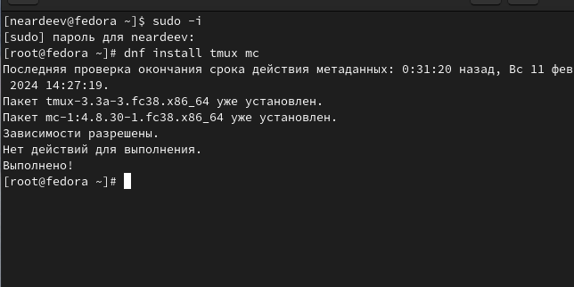
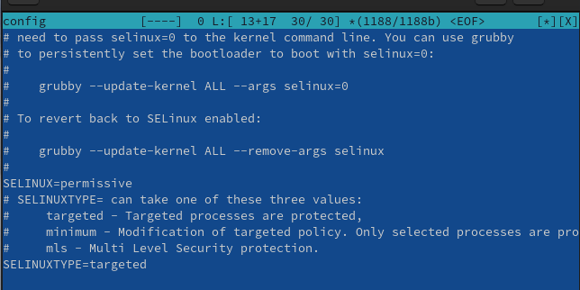
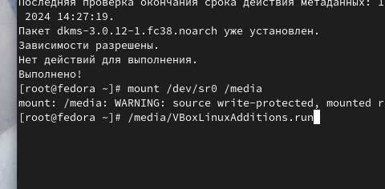
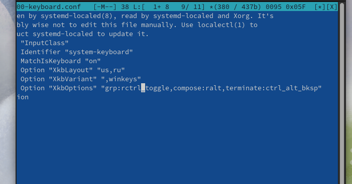
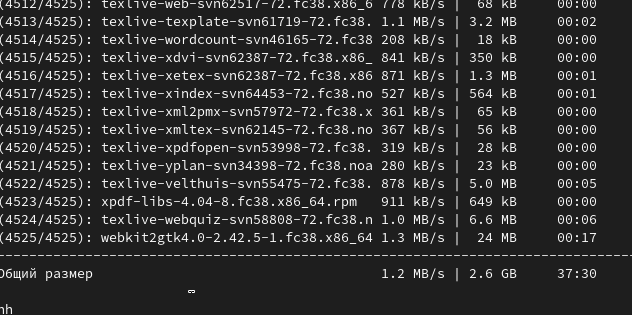
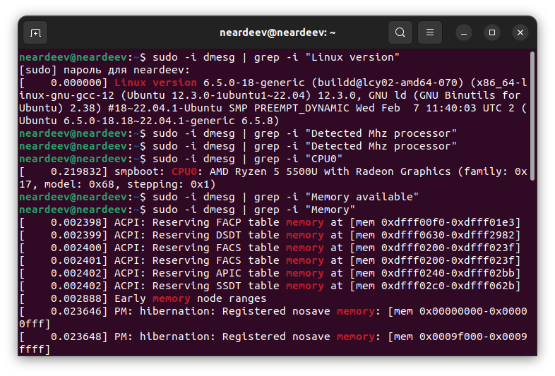
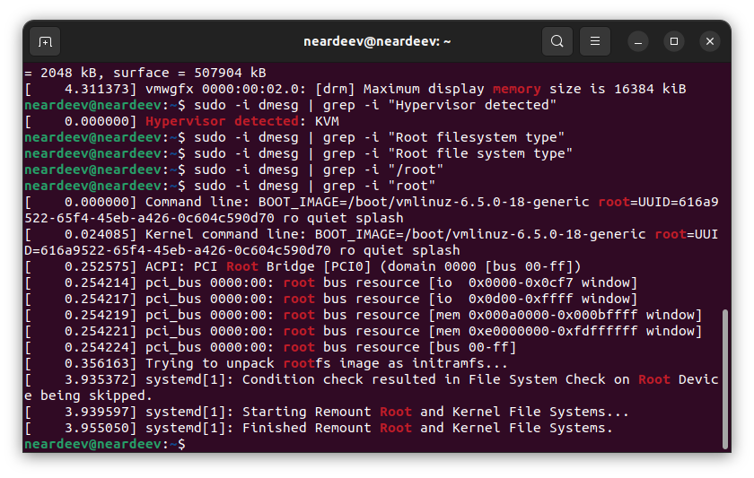
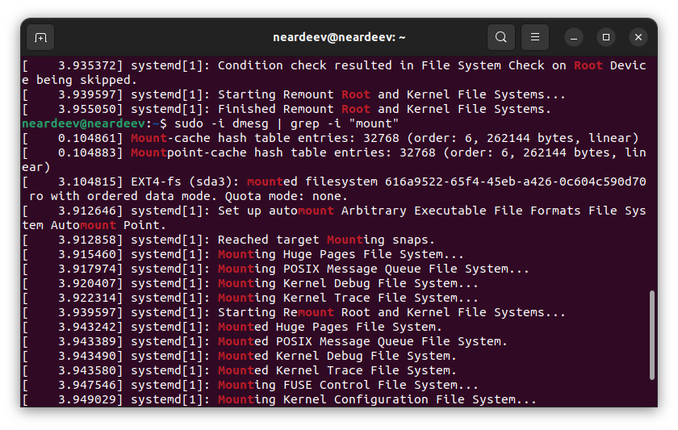

---
## Front matter
title: "Отчет по лабораторной работе №1"
subtitle: "Дисциплина: Операционные системы"
author: "Ардеев Никита Евгеньевич НММбд-01-23"

## Generic otions
lang: ru-RU
toc-title: "Содержание"

## Bibliography
bibliography: bib/cite.bib
csl: pandoc/csl/gost-r-7-0-5-2008-numeric.csl

## Pdf output format
toc: true # Table of contents
toc-depth: 2
lof: true # List of figures
lot: true # List of tables
fontsize: 12pt
linestretch: 1.5
papersize: a4
documentclass: scrreprt
## I18n polyglossia
polyglossia-lang:
  name: russian
  options:
	- spelling=modern
	- babelshorthands=true
polyglossia-otherlangs:
  name: english
## I18n babel
babel-lang: russian
babel-otherlangs: english
## Fonts
mainfont: PT Serif
romanfont: PT Serif
sansfont: PT Sans
monofont: PT Mono
mainfontoptions: Ligatures=TeX
romanfontoptions: Ligatures=TeX
sansfontoptions: Ligatures=TeX,Scale=MatchLowercase
monofontoptions: Scale=MatchLowercase,Scale=0.9
## Biblatex
biblatex: true
biblio-style: "gost-numeric"
biblatexoptions:
  - parentracker=true
  - backend=biber
  - hyperref=auto
  - language=auto
  - autolang=other*
  - citestyle=gost-numeric
## Pandoc-crossref LaTeX customization
figureTitle: "Рис."
tableTitle: "Таблица"
listingTitle: "Листинг"
lofTitle: "Список иллюстраций"
lotTitle: "Список таблиц"
lolTitle: "Листинги"
## Misc options
indent: true
header-includes:
  - \usepackage{indentfirst}
  - \usepackage{float} # keep figures where there are in the text
  - \floatplacement{figure}{H} # keep figures where there are in the text
---

# Цель работы

Целью данной работы является приобретение практических навыков установки операционной системы на виртуальную машину, настройки минимально необходимых для дальнейшей работы сервисов.

# Выполнение лабораторной работы

Переключился на права суперпользлвателя обновил все пакеты (рис. [-@fig:001]).

$ sudo -i
$ dnf -y update

{#fig:001 width=70%}

Установил програмы для удобства работы консоли (рис. [-@fig:002]).
$ dnf install tmux mc
{#fig:002 width=70%}

Не стал подключать автоматические обновления.

Отключил систему безопасности SELinux (рис. [-@fig:003]).

{#fig:003 width=70%}

Установил средства разработки: dnf -y group install "Development Tools". В меню виртуальной машины подключил образ диска дополнений гостевой ОС и подмонтирова диск: mount /dev/sr0 /media. Установил пакет DKMS: dnf -y install dkms. Установил драйвера /media/VBoxLinuxAdditions.run (рис. [-@fig:004]).

{#fig:004 width=70%}

Настроил раскладку клавиатуры, отредактировав конфигурационный файл /etc/X11/xorg.conf.d/00-keyboard.conf  (рис. [-@fig:005]).

{#fig:005 width=70%}

Настроил имя хоста, согласно пользовскому соглашению.

Установил pandoc (рис. [-@fig:006]).

 dnf -y install pandoc
 
 {#fig:006 width=70%}
 
 Установил texlive (рис. [-@fig:007]).
 
 dnf -y install texlive-scheme-full
 
 {#fig:007 width=70%}
 
# Домашнее задание

 Получил следующую информацию:

    Версия ядра Linux (Linux version).(рис. [-@fig:008])
    Частота процессора (Detected Mhz processor).(рис. [-@fig:008])
    Модель процессора (CPU0).(рис. [-@fig:008])
    Объём доступной оперативной памяти (Memory available).(рис. [-@fig:008])
    Тип обнаруженного гипервизора (Hypervisor detected). (рис. [-@fig:009])
    Тип файловой системы корневого раздела. (рис. [-@fig:009])
    Последовательность монтирования файловых систем.(рис. [-@fig:010])

 Через команду 
 
 dmesg | grep -i "то, что ищем"
 
 {#fig:008 width=70%}
 {#fig:009 width=70%}
 {#fig:010 width=70%}
 
# Ответы контрольные вопросы

Какую информацию содержит учётная запись пользователя?

Учётная запись содержит данные о пользователе, необходимые для регистрации в системе и дальнейшей работы с ней

 Укажите команды терминала и приведите примеры:
        для получения справки по команде;  
           "команда" -h
        для перемещения по файловой системе;
          $ cd ../
        для просмотра содержимого каталога;
        $ ls
        для определения объёма каталога;
         $ du
        для создания / удаления каталогов / файлов;
         mk rm touch
        для задания определённых прав на файл / каталог;
        chmod
        для просмотра истории команд.
        tail

    Что такое файловая система? Приведите примеры с краткой характеристикой.
    Файловая система — это структура, используемая операционной системой для организации и управления файлами на устройстве хранения, например на жестком диске, твердотельном накопителе (SSD) или USB-накопителе.
    Как посмотреть, какие файловые системы подмонтированы в ОС? findmnt
    
    Как удалить зависший процесс? kill killall

# Выводы

Научился нстраивать виртуальную машину, устанавливать на нее OC, первичной настройки Linux
