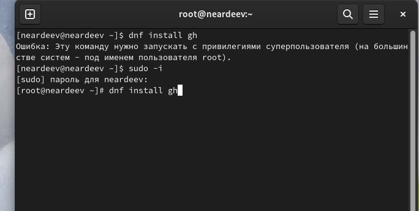
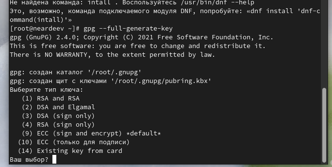
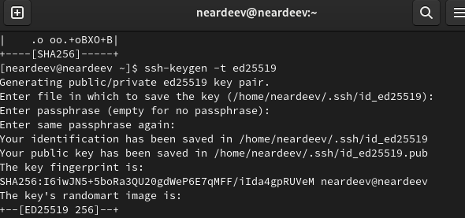
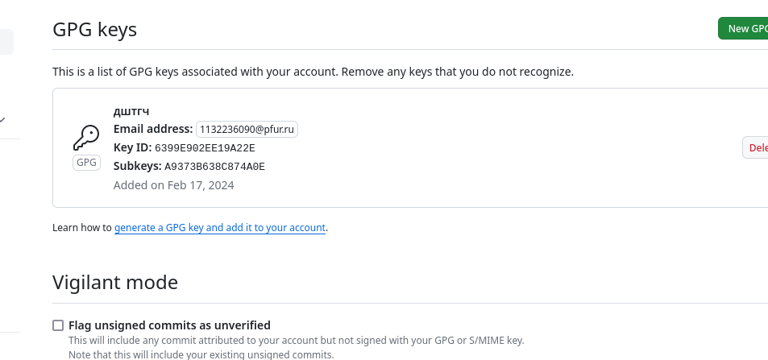
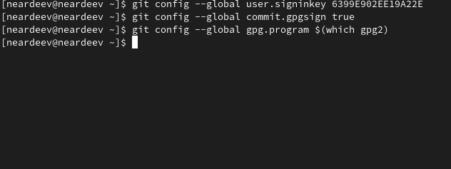
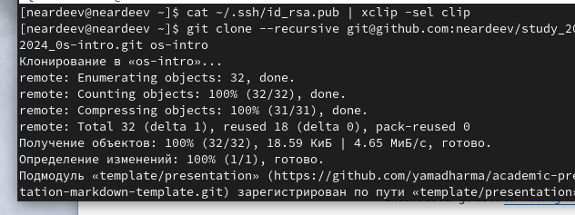

---
## Front matter
lang: ru-RU
title: Лабораторная работа 2
subtitle: 
author:
  - Ардеев Н. Е.
institute:
  - Российский университет дружбы народов, Москва, Россия

## i18n babel
babel-lang: russian
babel-otherlangs: english

## Formatting pdf
toc: false
toc-title: Содержание
slide_level: 2
aspectratio: 169
section-titles: true
theme: metropolis
header-includes:
 - \metroset{progressbar=frametitle,sectionpage=progressbar,numbering=fraction}
 - '\makeatletter'
 - '\beamer@ignorenonframefalse'
 - '\makeatother'
---

# Вводная часть

## Цели и задачи

- Изучить идеологию и применение средств контроля версий.
-Освоить умения по работе с git.

# Ход работы 

## Установим git

## Сгенерируем gpg и ssh ключи, вставим их на GitHub

{width=20%}
{width=20%} 
{width=20%}

## Настроим автоматическое подписание коммитов

## Создадим каталог курса в локальном репозитории

# Результаты

## Выводы

Установили локальный репозиторий с помощью навыуов работы с git

