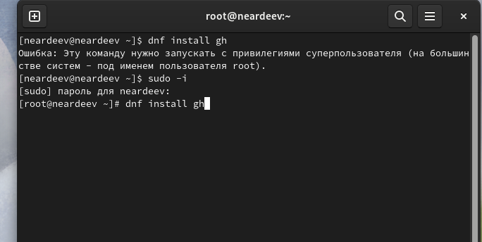

---
## Front matter
title: "Отчет по лабораторной работе №2"
subtitle: "Дисциплина: Операционные системы"
author: "Ардеев Никита Евгеньевич НММбд-01-23"

## Generic otions
lang: ru-RU
toc-title: "Содержание"

## Bibliography
bibliography: bib/cite.bib
csl: pandoc/csl/gost-r-7-0-5-2008-numeric.csl

## Pdf output format
toc: true # Table of contents
toc-depth: 2
lof: true # List of figures
lot: true # List of tables
fontsize: 12pt
linestretch: 1.5
papersize: a4
documentclass: scrreprt
## I18n polyglossia
polyglossia-lang:
  name: russian
  options:
	- spelling=modern
	- babelshorthands=true
polyglossia-otherlangs:
  name: english
## I18n babel
babel-lang: russian
babel-otherlangs: english
## Fonts
mainfont: PT Serif
romanfont: PT Serif
sansfont: PT Sans
monofont: PT Mono
mainfontoptions: Ligatures=TeX
romanfontoptions: Ligatures=TeX
sansfontoptions: Ligatures=TeX,Scale=MatchLowercase
monofontoptions: Scale=MatchLowercase,Scale=0.9
## Biblatex
biblatex: true
biblio-style: "gost-numeric"
biblatexoptions:
  - parentracker=true
  - backend=biber
  - hyperref=auto
  - language=auto
  - autolang=other*
  - citestyle=gost-numeric
## Pandoc-crossref LaTeX customization
figureTitle: "Рис."
tableTitle: "Таблица"
listingTitle: "Листинг"
lofTitle: "Список иллюстраций"
lotTitle: "Список таблиц"
lolTitle: "Листинги"
## Misc options
indent: true
header-includes:
  - \usepackage{indentfirst}
  - \usepackage{float} # keep figures where there are in the text
  - \floatplacement{figure}{H} # keep figures where there are in the text
---

# Цель работы

Изучить идеологию и применение средств контроля версий. Освоить умения по работе с git.

# Задание

    1.Создать базовую конфигурацию для работы с git.
    2.Создать ключ SSH.
    3.Создать ключ PGP.
    4.Настроить подписи git.
    5.Зарегистрироваться на Github.
    6.Создать локальный каталог для выполнения заданий по предмету.

# Выполнение лабораторной работы

 Установил git: (рис. [-@fig:001]).

   $ dnf install git

 {#fig:001 width=70%}

 Авторизовался на github. Настроил utf-8 в выводе сообщений git. Задал имя начальной ветки, параметр autocrlf, параметр safecrlf (рис. [-@fig:002]).

{#fig:002 width=70%}

Создал ключ ssh (рис. [-@fig:003]).

{#fig:003 width=70%}

 Генерирую ключи gpg, создал и  настроил их (рис. [-@fig:004]).

{#fig:004 width=70%}

Вывел список ключ'й и скопировал их в буфер обмена  (рис. [-@fig:005]).

 $ gpg --list-secret-keys --keyid-format LONG
 $ gpg --armor --export <PGP Fingerprint> | xclip -sel clip
 
{#fig:005 width=70%}

Добавил ключ на github(рис. [-@fig:006]).

{#fig:006 width=70%}

 Используя введёный email, указал Git применять его при подписи коммитов (рис. [-@fig:007]).

{#fig:007 width=70%}

 Авторизовался на github (рис. [-@fig:008]).

{#fig:008 width=70%}

 Создал репозиторий на основе шаблона курса (рис. [-@fig:009]).

{#fig:009 width=70%}

{#fig:010 width=70%}

Затем настроил каталог курса, а измененя загрузил на github

# Выводы

Я освоил умения по работе с git, а именно создавать репозиторий, настраивать ключи безопасности.

# Контрольные вопросы
1. Системы контроля версий (Version Control System, VCS) применяются при работе нескольких человек над одним проектом. При внесении изменений в содержание проекта система контроля версий позволяет их фиксировать, совмещать изменения, произведённые разными участниками проекта, производить откат к любой более ранней версии проекта, если это требуется.
2. Хранилище версий - в нем хранятся все документы вместе с историей их изменения и другой служебной информацией. Рабочая копия - копия проекта, связанная с репозиторием. Рабочую копию необходимо периодически синхронизировать с репозиторием, эта операция предполагает отправку в него изменений, которые пользователь внес в свою рабочую копию, такая операция называется commit.
3. Централизованные системы контроля версий представляют собой приложения типа клиент-сервер, когда репозиторий проекта существует в единственном экземпляре и хранится на сервере. Доступ к нему осуществлялся через специальное клиентское приложение. В качестве примеров таких программных продуктов можно привести CVS, Subversion. Децентрализованные VCS у каждого пользователя свой вариант (возможно не один) репозитория, присутствует возможность добавлять и забирать изменения из любого репозитория, примеры: Git, Mercurial, Bazaar.
4. Инициализация (создание) репозитория. Добавление новых файлов. Коммит. Любые операции с файлами (добавление, удаление или изменение).
5. Команда git add добавляет содержимое рабочего каталога в индекс (staging area) для последующего коммита. По умолчанию git commit использует лишь этот индекс, так что вы можете использовать git add для сборки слепка вашего следующего коммита.  Создание основного дерева репозитория: git init. Получение обновлений (изменений) текущего дерева из центрального репозитория: git pull. Отправка всех произведённых изменений локального дерева в центральный репозиторий: git push. Просмотр списка изменённых файлов в текущей директории:git status.
Просмотр текущих изменений:git diff. удалить файл и/или каталог из индекса репозитория (при этом файл и/или каталог остаётся в локальной директории): git rm имена_файлов. сохранить все добавленные изменения и все изменённые файлы: git commit -am 'Описание коммита'.
6. 
1. Клонирование репозитория: Для начала работы над проектом вы можете клонировать удаленный репозиторий на свой локальный компьютер с помощью команды git clone <URL репозитория>, где <URL репозитория> - это ссылка на ваш удаленный репозиторий на GitHub.

   2. Добавление изменений и коммит: После внесения изменений в проект (например, добавление нового файла или обновление существующего), вы добавляете эти изменения в индекс с помощью git add <файлы> и фиксируете их с комментарием коммита с помощью git commit -m "Ваш комментарий здесь".

  3. Отправка изменений на удаленный репозиторий: После фиксации изменений в локальном репозитории, вы отправляете их на удаленный репозиторий с помощью git push origin <название-ветки>, где <название-ветки> - это название ветки, на которой вы работаете.

  4. Получение изменений из удаленного репозитория: Чтобы обновить свой локальный репозиторий данными из удаленного репозитория, используйте git pull origin <название-ветки>.

  5. Создание новой ветки и слияние изменений: Для разработки новой функциональности часто создают новую ветку с помощью git checkout -b <название-новой-ветки> и затем сливают её изменения с основной веткой с помощью git merge <название-ветки>.
7. Ветви (branches) в системах контроля версий, таких как Git, представляют собой "копии" основного кодового потока (обычно называемого мастер-веткой или main-веткой), в которых вы можете работать независимо от основного кода. Изоляция функциональности: Создание ветви позволяет изолировать новую функциональность, исправление ошибок или эксперименты от основного кода. Это предотвращает преждевременное влияние изменений на основной код. Параллельное развитие: Команде разработчиков можно работать над несколькими задачами одновременно, используя разные ветви. Это способствует параллельному развитию различных функций.
8. Игнорирование определенных файлов при коммите в Git осуществляется с помощью файла .gitignore. Этот файл содержит шаблоны файлов и директорий, которые Git должен игнорировать.

Вот как вы можете использовать .gitignore и зачем это может быть полезно:

 1. Скрытие конфиденциальной информации: Если у вас есть файлы с конфиденциальной информацией, такие как пароли, ключи API или личные данные, вы можете добавить эти файлы в .gitignore, чтобы они не попали в репозиторий.

 2. Исключение временных файлов и компиляционных результатов: Часто в проектах создаются временные файлы или файлы, сгенерированные в процессе компиляции. Их можно исключить из коммитов, чтобы не захламлять репозиторий.

 3. Игнорирование локальных конфигурационных файлов: Локальные файлы настройки разработчика, которые могут меняться на каждой машине (например, файлы .env), также можно исключить из репозитория.

 4. Избавление от кэшированных и временных файлов: Игнорирование файлов кэша или временных файлов, которые создаются в процессе работы системы, помогает избежать ненужных конфликтов при слиянии и уменьшает размер репозитория.

Чтобы использовать .gitignore, создайте файл с таким именем в корневой директории вашего репозитория и добавьте в него шаблоны файлов и директорий, которые нужно игнорировать. После добавления .gitignore выполните коммит, чтобы применить его изменения. Это поможет избежать нежелательных файлов в вашем репозитории и облегчит работу с командой разработчиков.
9. При единоличной работе с системой управления версиями (VCS) процесс может быть более простым, чем при коллективной разработке, но все равно имеет свои особенности. Вот типичные действия, которые могут выполняться при единоличной работе с репозиторием:

 1. Инициализация репозитория: В начале проекта создается локальный репозиторий с помощью команды git init. Это действие выполняется один раз, чтобы начать отслеживание изменений.

 2. Добавление файлов и коммит изменений: После внесения изменений в файлы проекта, вы добавляете их в индекс с помощью git add <файлы> и фиксируете с изменениями с комментарием коммита через git commit -m "Ваш комментарий".

 3. Просмотр истории коммитов: Для просмотра истории коммитов и изменений в проекте используйте git log, чтобы отслеживать процесс развития проекта.

 4. Создание и переключение веток: При необходимости работы над различными аспектами проекта может потребоваться создание и переключение веток с помощью git branch <название-ветки> и git checkout <название-ветки>.

 5. Откат изменений: В случае необходимости откатить изменения до определенной точки, можно использовать git reset или git revert.

 6. Работа с удаленным репозиторием (необязательно): При желании можно связать локальный репозиторий с удаленным (например, на GitHub) и отправлять изменения на удаленный сервер через git push.

Хотя при единоличной работе с репозиторием процесс более простой по сравнению с командной разработкой, использование системы управления версиями все равно целесообразно. Он поможет отслеживать изменения, восстанавливать предыдущие версии проекта и обеспечивать целостность и безопасность кода.
10. Работа с общим хранилищем системы управления версиями (VCS) включает в себя совместную разработку проекта несколькими участниками. Вот основные шаги и порядок работы при коллективном использовании VCS:

 1. Клонирование репозитория: Каждый участник проекта клонирует общий репозиторий на свой компьютер с помощью команды git clone <URL репозитория>. Это создает локальную копию репозитория на каждом устройстве разработчика.

 2. Создание и переключение веток: Разработчики могут создавать собственные ветки для работы над конкретными задачами с помощью git branch <название-ветки> и переключаться между ветками с использованием git checkout <название-ветки>.

 3. Добавление и фиксация изменений: Каждый участник вносит свои изменения в проект, добавляет их в индекс с помощью git add и фиксирует с комментарием коммита через git commit -m "Ваш комментарий". Также важно регулярно обновлять свою локальную версию через git pull.

 4. Работа с конфликтами: В случае возникновения конфликтов при слиянии изменений, разработчики должны их разрешить вручную, обсудить изменения и продолжить слияние.

 5. Отправка изменений на удаленный репозиторий: После завершения работы над задачей участник отправляет свои изменения на общий репозиторий с помощью git push origin <название-ветки>.

 6. Code review: Разработчики могут проводить взаимные code review, чтобы проверить и просмотреть изменения, улучшить качество кода и обменяться мнениями.

 7. Интеграция изменений: Когда работа всех участников завершена, происходит слияние изменений (merge) в основную ветку проекта. 

 8. Устранение ошибок и поддержка: После интеграции изменений важно отслеживать ошибки,  проводить тестирование и поддерживать проект в актуальном состоянии.

Это основной порядок работы с общим хранилищем VCS при коллективной разработке проекта. Соблюдение данного процесса помогает управлять изменениями, избежать конфликтов и обеспечить согласованность и качество кодовой базы проекта.

