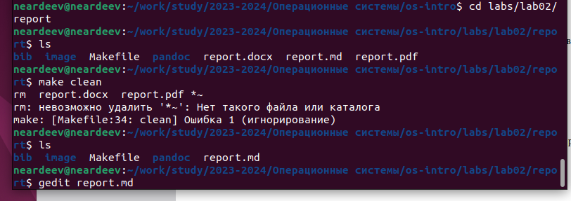
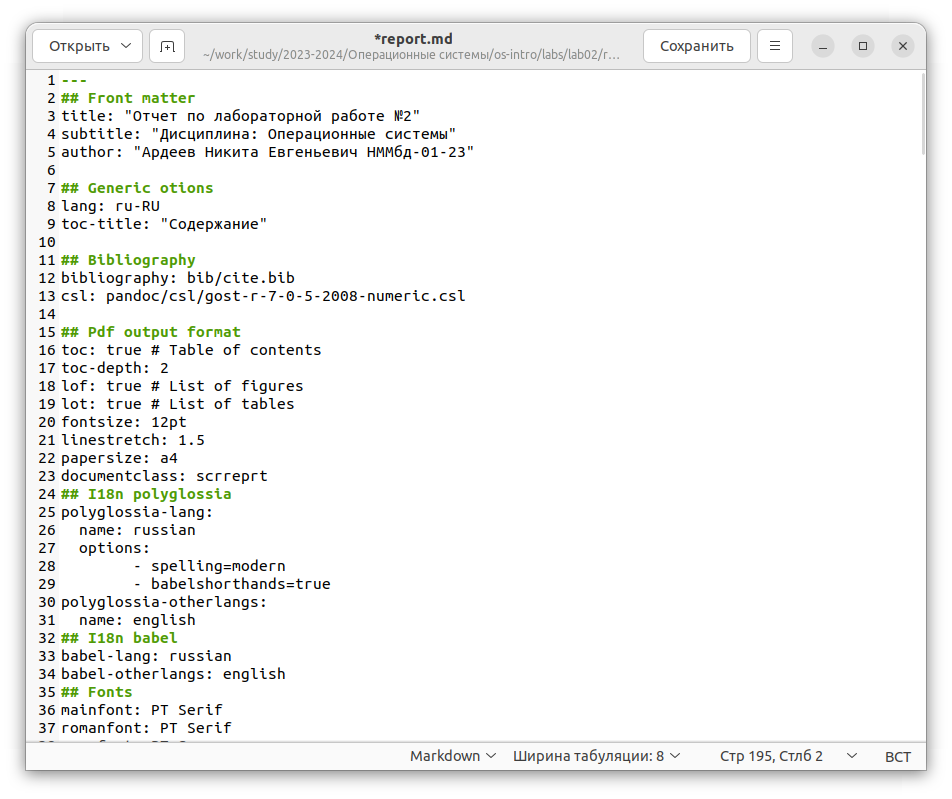
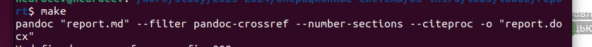
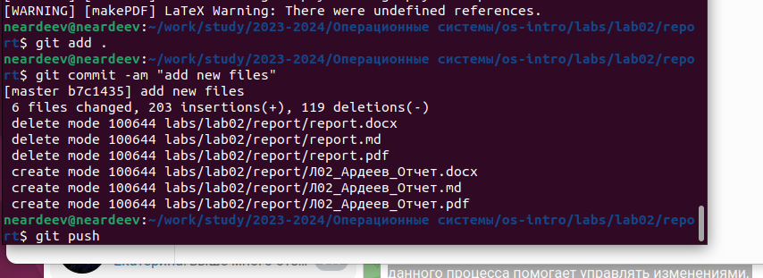

---
## Front matter
lang: ru-RU
title: Лабораторная работа 3
subtitle:
author:
  - Ардеев Н. Е.
institute:
  - Российский университет дружбы народов, Москва, Россия
  
## i18n babel
babel-lang: russian
babel-otherlangs: english

## Formatting pdf
toc: false
toc-title: Содержание
slide_level: 2
aspectratio: 169
section-titles: true
theme: metropolis
header-includes:
 - \metroset{progressbar=frametitle,sectionpage=progressbar,numbering=fraction}
 - '\makeatletter'
 - '\beamer@ignorenonframefalse'
 - '\makeatother'
---

# Вводная часть

## Цели и задачи

 - Научиться оформлять отчёты с помощью легковесного языка разметки Markdown.

# Ход работы

## Перешел в каталог с лабораторной работой

## Отредактировал шаблон по лабораторной работе

## Сгенерировал отчет в трех форматах

## Отправил изменения на GitHub

# Результаты

## Выводы

 - Успешно создал отчет в Markdown
