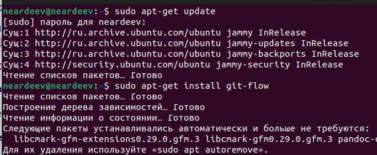
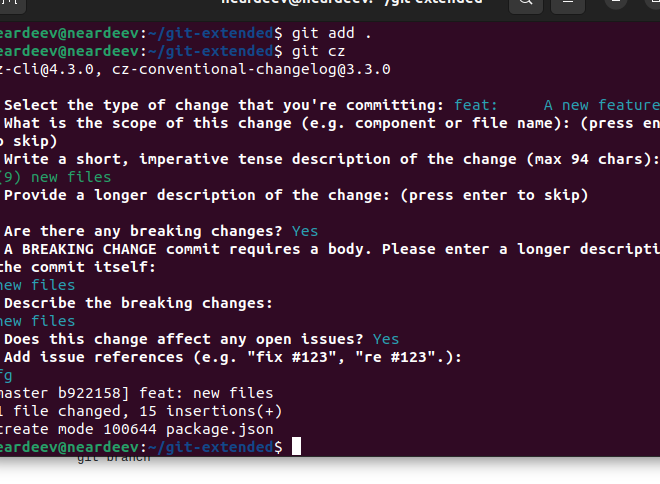
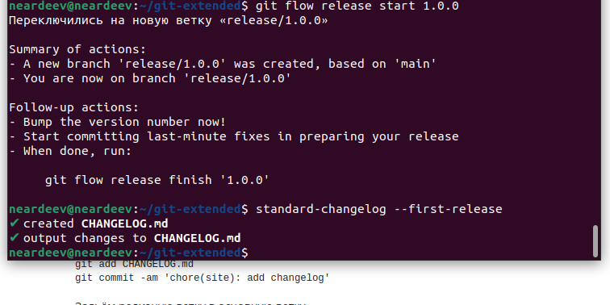
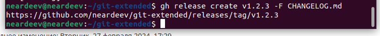
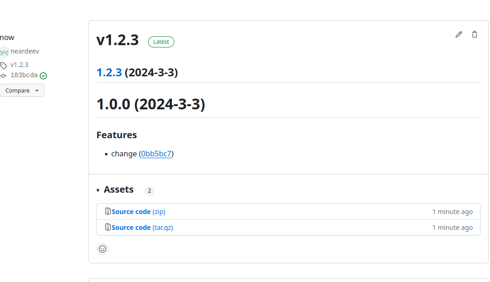

---
## Front matter
lang: ru-RU
title: Лабораторная работа №4
subtitle: 
author:
  - Ардеев Н. Е.
institute:
  - Российский университет дружбы народов, Москва, Россия

## i18n babel
babel-lang: russian
babel-otherlangs: english

## Formatting pdf
toc: false
toc-title: Содержание
slide_level: 2
aspectratio: 169
section-titles: true
theme: metropolis
header-includes:
 - \metroset{progressbar=frametitle,sectionpage=progressbar,numbering=fraction}
 - '\makeatletter'
 - '\beamer@ignorenonframefalse'
 - '\makeatother'
---

# Вводная часть

## Цели и задачи

- Получение навыков правильной работы с репозиториями git.

# Основная часть

## Установим git-flow

 

## Проверим на практике commitzen

 

## Создадим релиз и запишем в файл изменений

 

## Отправим релиз на GitHub

 

## Результат действий на GITHUB

 

# Результаты

- Научились выпускать релизы на GitHub

