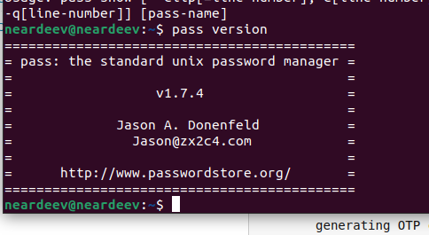
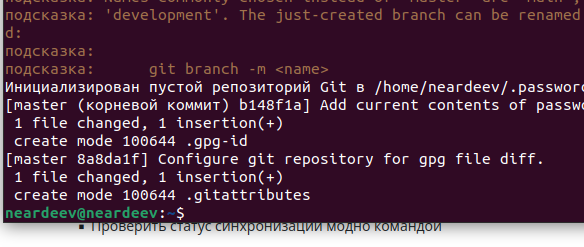
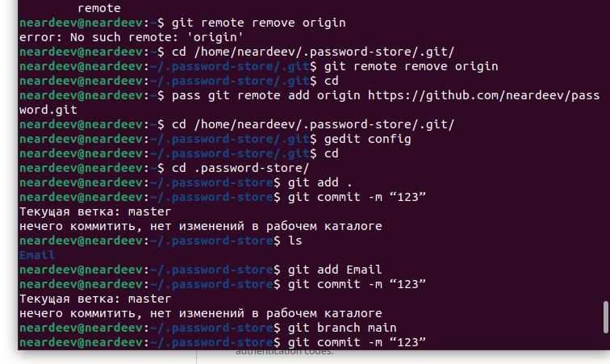
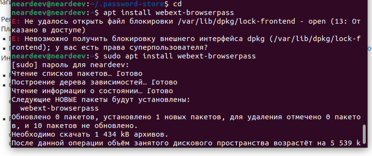
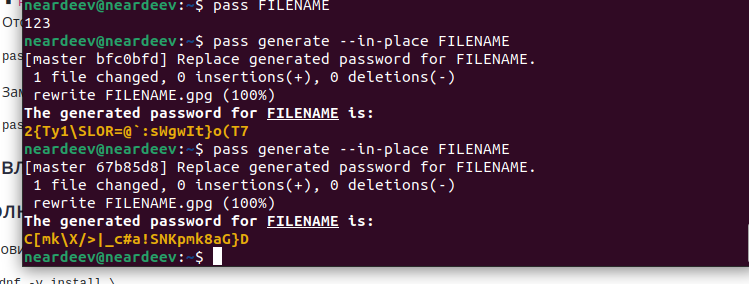
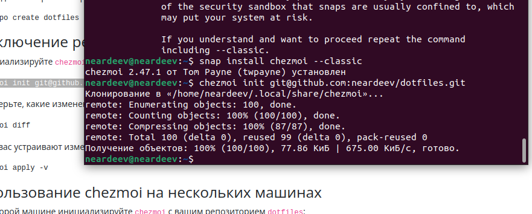

---
## Front matter
lang: ru-RU
title: Лабораторная работа №5
subtitle: Операционные системы
author:
  - Ардеев Н. Е.
institute:
  - Российский университет дружбы народов, Москва, Россия
## i18n babel
babel-lang: russian
babel-otherlangs: english

## Formatting pdf
toc: false
toc-title: Содержание
slide_level: 2
aspectratio: 169
section-titles: true
theme: metropolis
header-includes:
 - \metroset{progressbar=frametitle,sectionpage=progressbar,numbering=fraction}
 - '\makeatletter'
 - '\beamer@ignorenonframefalse'
 - '\makeatother'
---

# Вводная часть

## Цели и задачи

- Настройка рабочей среды

# Ход работы

## Установка pass

##  Создали структуру git

## Создадим репозиторий с паролями 

## Настроим интерфейс с браузером 

## Создадим пароль

## Установим chezmoi

# Результаты

## Выводы
- Настроили рабочую среду
