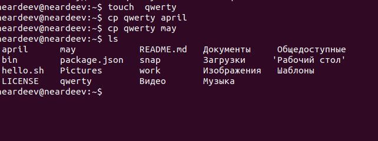
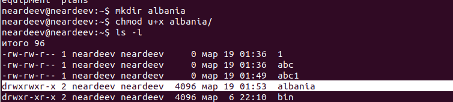
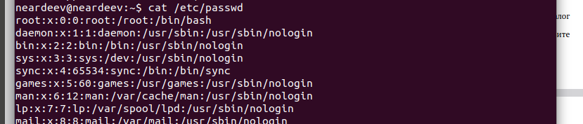
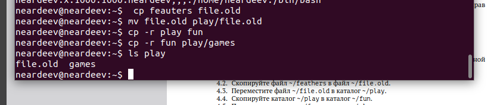

---
## Front matter
lang: ru-RU
title: Отчет по лабораторной №7
author:
  - Ардеев Н. Е.

## i18n babel
babel-lang: russian
babel-otherlangs: english

## Formatting pdf
toc: false
toc-title: Содержание
slide_level: 2
aspectratio: 169
section-titles: true
theme: metropolis
header-includes:
 - \metroset{progressbar=frametitle,sectionpage=progressbar,numbering=fraction}
 - '\makeatletter'
 - '\beamer@ignorenonframefalse'
 - '\makeatother'
---

## Цели и задачи

Ознакомление с файловой системой Linux, её структурой, именами и содержанием
каталогов. Приобретение практических навыков по применению команд для работы
с файлами и каталогами, по управлению процессами (и работами), по проверке исполь-
зования диска и обслуживанию файловой системы.

## Выполним примеры из основной части лабораторной. Тут были испольщованы команды cd, ls, cp.

## Настроим файлам соответсвующие права доступа

## Файл passwrd

## перемещение каталогов друг в друга

## Прочтем мануалы по mount, fsck, mkfs, kill

- mount для подключения дисков
- fsck для восстановления файловой системы
- mkfs для создания файловой системы
- kill для отправки сигнала на процесс

## Результаты

Мы ознакомились с файловой системыой LInux и ее структурой, именами и содержание м каталогов
