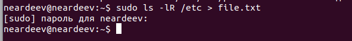
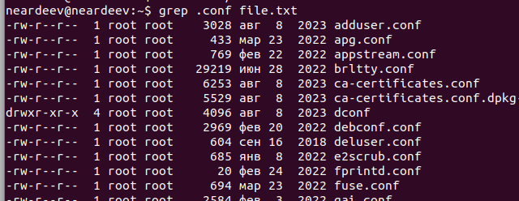
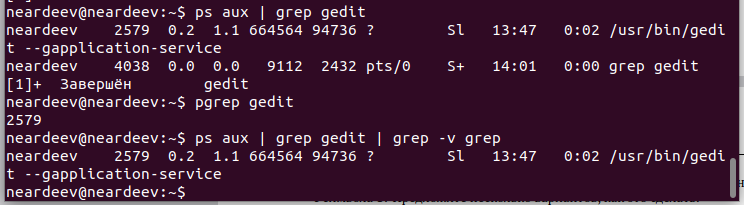
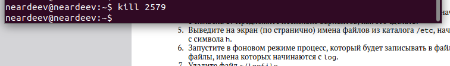

---
## Front matter
lang: ru-RU
title: Презентация лабораторной номер №8
author:
  - Ардеев Н. Е.
institute:
  - Российский университет дружбы народов, Москва, Россия

## i18n babel
babel-lang: russian
babel-otherlangs: english

## Formatting pdf
toc: false
toc-title: Содержание
slide_level: 2
aspectratio: 169
section-titles: true
theme: metropolis
header-includes:
 - \metroset{progressbar=frametitle,sectionpage=progressbar,numbering=fraction}
 - '\makeatletter'
 - '\beamer@ignorenonframefalse'
 - '\makeatother'
---

## Цель работы

Ознакомление с инструментами поиска файлов и фильтрации текстовых данных.
Приобретение практических навыков: по управлению процессами (и заданиями), по
проверке использования диска и обслуживанию файловых систем.

# Результаты

## Запишем в file.txt названия файлов из /etc затем 

## Выведем все файлы с расширением .conf

## запуск в фоновом режиме записи в файл  ./logfile

## узнаем номер процесса gedit двумя способами, через ps и pgrep

## завершим процесс командой kill 

# Выводы

##  Резултаты 

Я ознакомился с инструментами поиска файлов и фильтрации текстовых данных.
Приобрел практических навыков: по управлению процессами (и заданиями), по
проверке использования диска и обслуживанию файловых систем.

