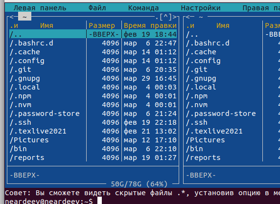
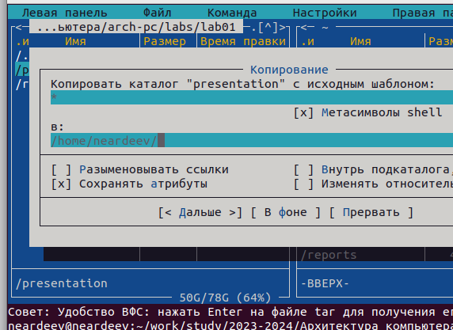
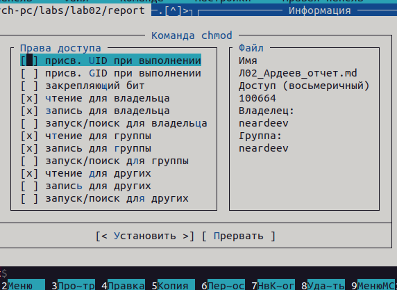
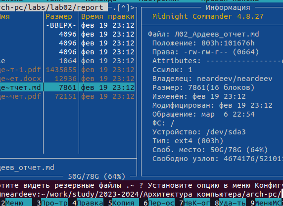
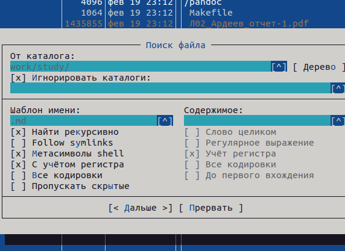
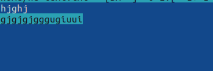
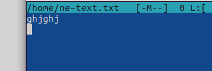

---
## Front matter
lang: ru-RU
title: Лабораторная работа №7
subtitle: Операционные системы
author:
  - Ардеев Н. Е.
institute:
  - Российский университет дружбы народов, Москва, Россия

date: 15 марта 2023

## i18n babel
babel-lang: russian
babel-otherlangs: english

## Formatting pdf
toc: false
toc-title: Содержание
slide_level: 2
aspectratio: 169
section-titles: true
theme: metropolis
header-includes:
 - \metroset{progressbar=frametitle,sectionpage=progressbar,numbering=fraction}
 - '\makeatletter'
 - '\beamer@ignorenonframefalse'
 - '\makeatother'
---

## Цель работы

Освоение основных возможностей командной оболочки Midnight Commander. Приоб-
ретение навыков практической работы по просмотру каталогов и файлов; манипуляций
с ними.

## Ввожу в терминале mc 

## С помощью F5 могу создать копию файла в выбранном каталоге  

## С помощью управляющих клавиш так же можно получить информацию о правах доступа на файл и информацию о нем 

## В меню правой панели вывел информацию о файле 

## Поиск файла формата .txt с помощью средств подменю Команда

{#fig:008 width=70%}

## Выделяю текст с помощью клавиши F3 и кликов мышью. Перемещаю выделенный текст с помощью клавиши F6

## Удалил строку текста с помощью ctrl+y  

# Выводы

Освоил основные возможности командной оболочки Midnight Commander. Приоб-
ретел навыки практической работы по просмотру каталогов и файлов; манипуляций
с ними.
