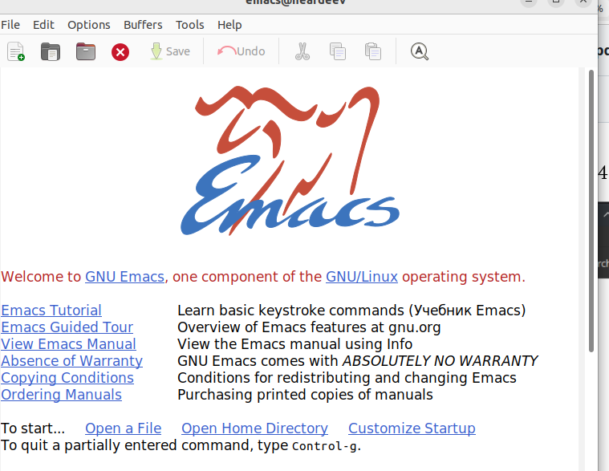
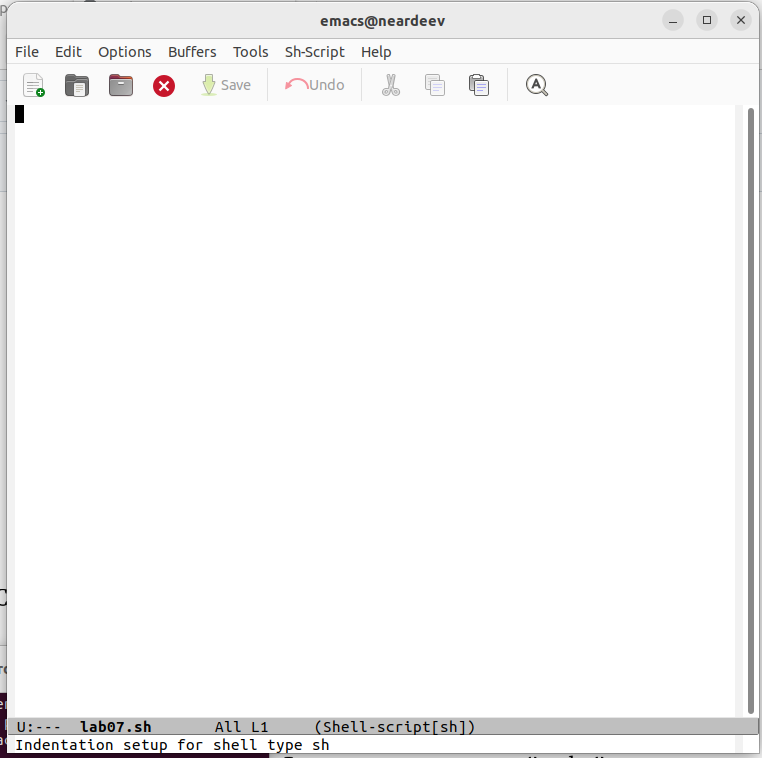
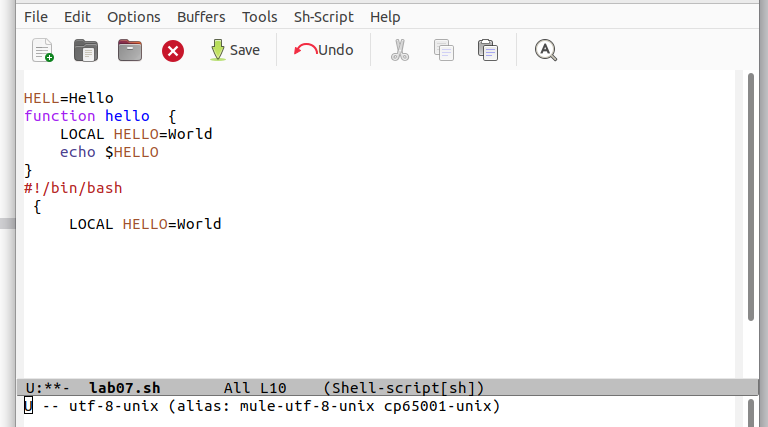
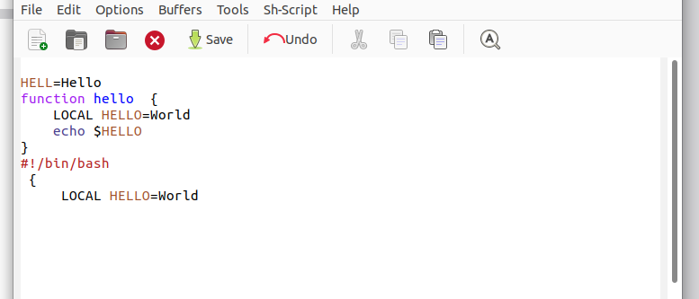
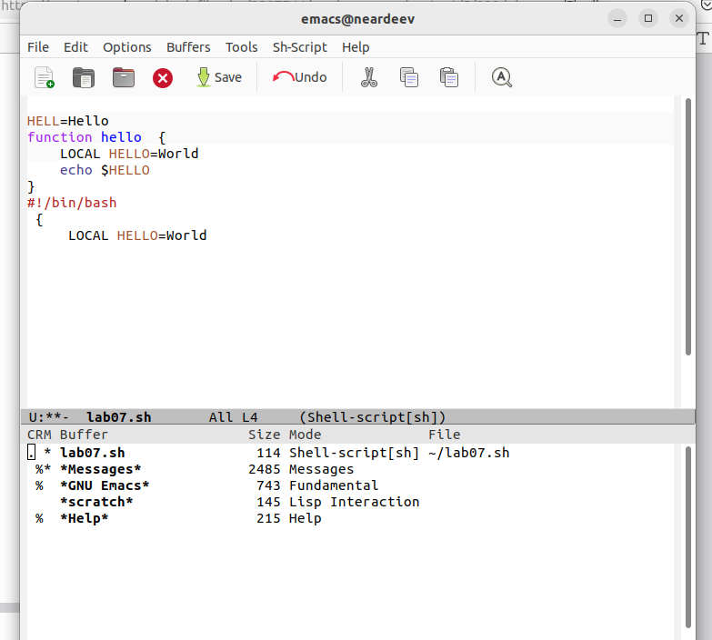
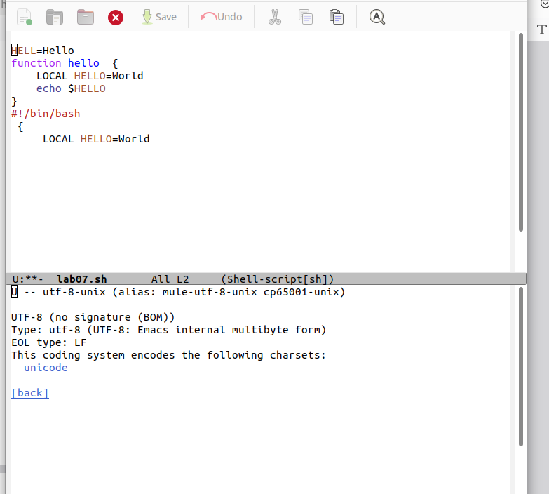
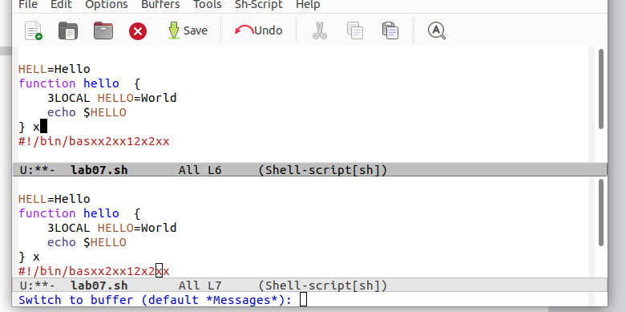

---
## Front matter
lang: ru-RU
title: Лабораторная работа 11
subtitle: презентация
author:
  - Ардеев Н. Е.
institute:
  - Российский университет дружбы народов, Москва, Россия
  
## i18n babel
babel-lang: russian
babel-otherlangs: english

## Formatting pdf
toc: false
toc-title: Содержание
slide_level: 2
aspectratio: 169
section-titles: true
theme: metropolis
header-includes:
 - \metroset{progressbar=frametitle,sectionpage=progressbar,numbering=fraction}
 - '\makeatletter'
 - '\beamer@ignorenonframefalse'
 - '\makeatother'
---

# Вводная часть

## Цели и задачи

Познакомиться с операционной системой Linux. Получить практические навыки рабо-
ты с редактором Emacs.

# Выполнение работы

## Открыл emacs

{#fig:001 width=70%}

## Создал файл 

{#fig:002 width=70%}

## Написал текст , сохранил файл 

{#fig:003 width=70%}

## Проделал с текстом стандартные процедуры редактирования

{#fig:004 width=70%}

## Научился использовать команды по перемещению курсора

## Управлял буферами

## Управлял окнами 

## Режим поиска

# Выводы

Получил практические навыки работы с emacs

