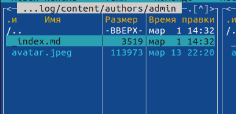
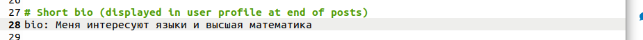
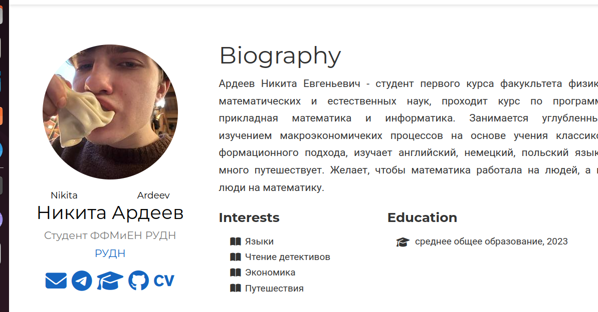
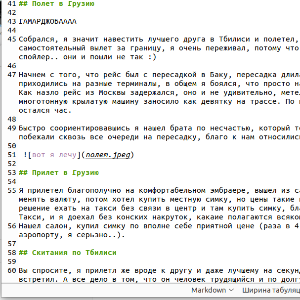
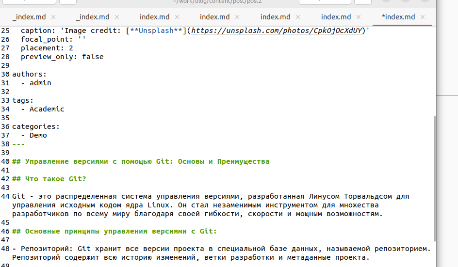
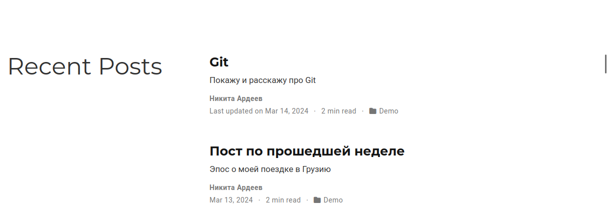
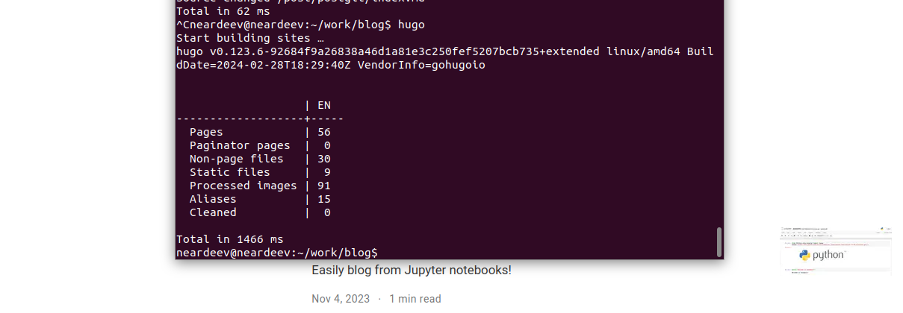
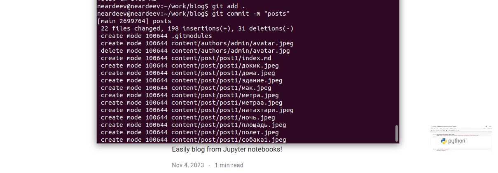
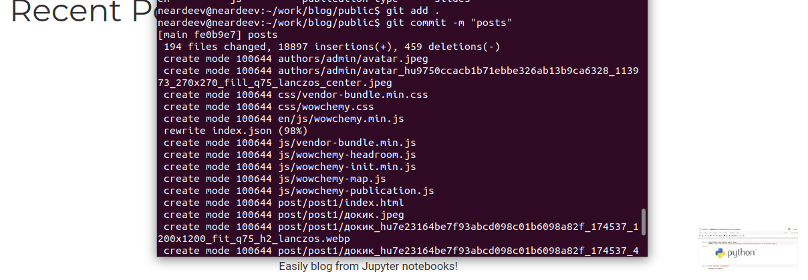
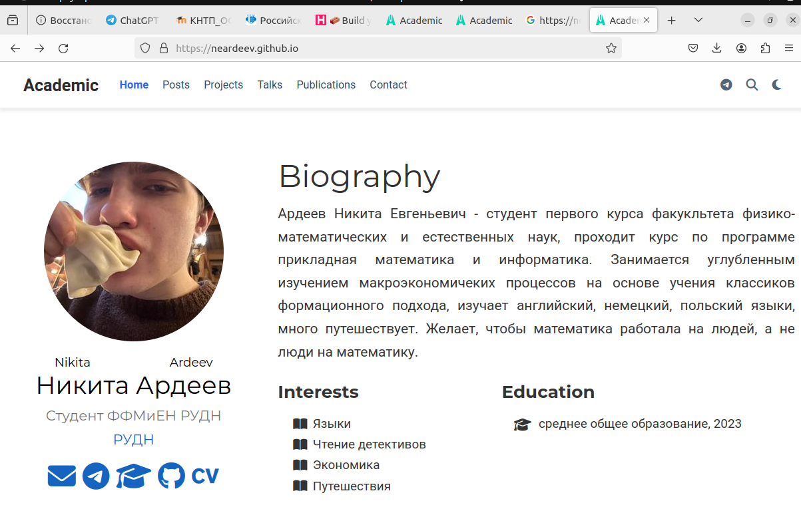

---
## Front matter
title: "Отчет Индивидуальный проект "
subtitle: "Этап №2"
author: "Ардеев НИкита Евгеньевич"

## Generic otions
lang: ru-RU
toc-title: "Содержание"

## Bibliography
bibliography: bib/cite.bib
csl: pandoc/csl/gost-r-7-0-5-2008-numeric.csl

## Pdf output format
toc: true # Table of contents
toc-depth: 2
lof: true # List of figures
lot: true # List of tables
fontsize: 12pt
linestretch: 1.5
papersize: a4
documentclass: scrreprt
## I18n polyglossia
polyglossia-lang:
  name: russian
  options:
	- spelling=modern
	- babelshorthands=true
polyglossia-otherlangs:
  name: english
## I18n babel
babel-lang: russian
babel-otherlangs: english
## Fonts
mainfont: PT Serif
romanfont: PT Serif
sansfont: PT Sans
monofont: PT Mono
mainfontoptions: Ligatures=TeX
romanfontoptions: Ligatures=TeX
sansfontoptions: Ligatures=TeX,Scale=MatchLowercase
monofontoptions: Scale=MatchLowercase,Scale=0.9
## Biblatex
biblatex: true
biblio-style: "gost-numeric"
biblatexoptions:
  - parentracker=true
  - backend=biber
  - hyperref=auto
  - language=auto
  - autolang=other*
  - citestyle=gost-numeric
## Pandoc-crossref LaTeX customization
figureTitle: "Рис."
tableTitle: "Таблица"
listingTitle: "Листинг"
lofTitle: "Список иллюстраций"
lotTitle: "Список таблиц"
lolTitle: "Листинги"
## Misc options
indent: true
header-includes:
  - \usepackage{indentfirst}
  - \usepackage{float} # keep figures where there are in the text
  - \floatplacement{figure}{H} # keep figures where there are in the text
---

# Цель работы

Добавить к сайту данные о себе

# Задание

    Разместить фотографию владельца сайта.
    Разместить краткое описание владельца сайта (Biography).
    Добавить информацию об интересах (Interests).
    Добавить информацию от образовании (Education).

Сделать пост по прошедшей неделе.
Добавить пост на тему по выбору:

    Управление версиями. Git.
    Непрерывная интеграция и непрерывное развертывание (CI/CD).
    
# Выполнение лабораторной работы

 Удалил шаблон фото, добавил свое (рис. [-@fig:001]).

{#fig:001 width=70%}

Заполнил данные о себе(рис. [-@fig:002]).

{#fig:002 width=70%}

Проверил с помощью hugo server(рис. [-@fig:003]).

{#fig:003 width=70%}

Написал пост о своей неделе(рис. [-@fig:004]).

{#fig:004 width=70%}

Написал пост про git(рис. [-@fig:005]).

{#fig:005 width=70%}

Проверил(рис. [-@fig:006]).

{#fig:006 width=70%}

Сгенерировал сайт(рис. [-@fig:007]).

{#fig:007 width=70%}

Сохраняю изменения(рис. [-@fig:008]).

{#fig:008 width=70%}

Сохраняю в public (рис. [-@fig:009]).

{#fig:009 width=70%}

Проверяю на публичном сайте(рис. [-@fig:010]).

{#fig:010 width=70%}

# Выводы

Добавили к сайту данные о себе

