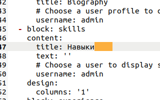
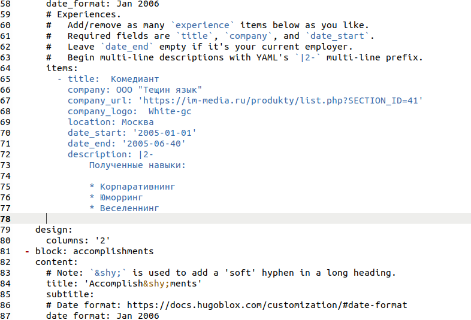
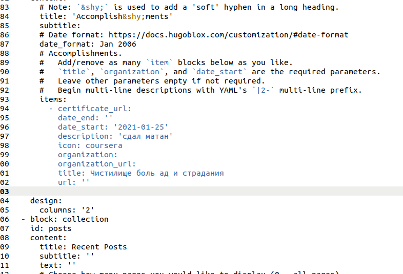
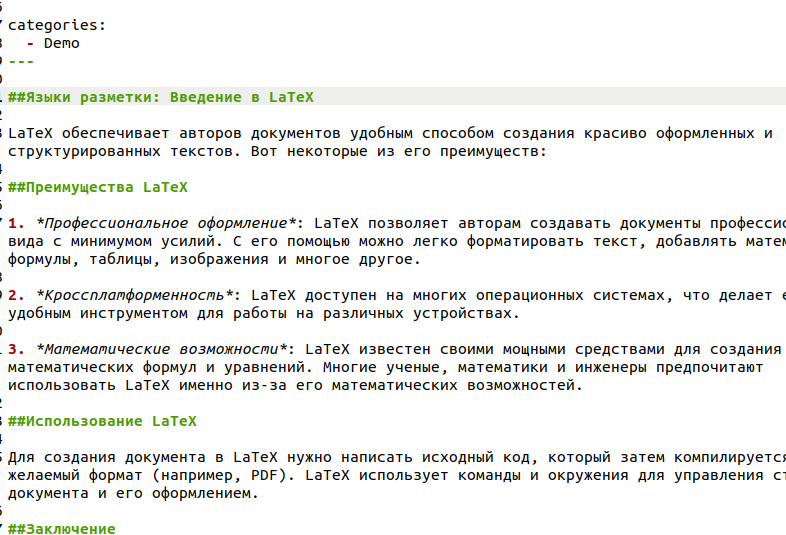
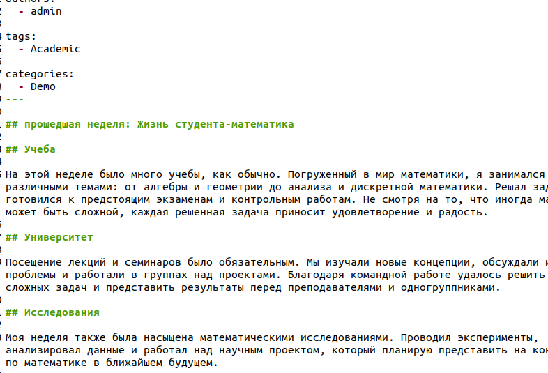

---
## Front matter
lang: ru-RU
title: Этап индивидуального проекта №3
subtitle: Операционные системы
author:
  - Ардеев Н. Е.
institute:
  - Российский университет дружбы народов, Москва, Россия

date: 7 апреля 2023

## i18n babel
babel-lang: russian
babel-otherlangs: english

## Formatting pdf
toc: false
toc-title: Содержание
slide_level: 2
aspectratio: 169
section-titles: true
theme: metropolis
header-includes:
 - \metroset{progressbar=frametitle,sectionpage=progressbar,numbering=fraction}
 - '\makeatletter'
 - '\beamer@ignorenonframefalse'
 - '\makeatother'
---

## Цель работы

 Добавить к сайту достижения.

## Задание

Список достижений.
        Добавить информацию о навыках (Skills).
        Добавить информацию об опыте (Experience).
        Добавить информацию о достижениях (Accomplishments).
    Сделать пост по прошедшей неделе.
    Добавить пост на тему по выбору:
        Легковесные языки разметки.
        Языки разметки. LaTeX.
        Язык разметки Markdown.

## Прописываем навыки

иотеки fab

## Опыт

## Достижения

 достижения

## Пост про LaTex

## Пост по прошедшей неделе

## Выводы

Добавили достижения
