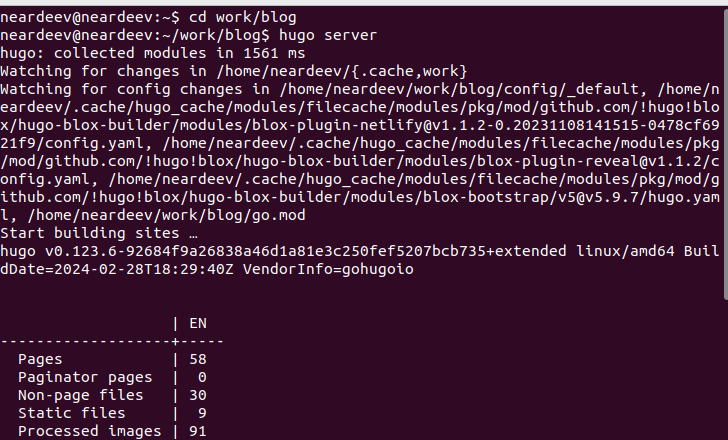
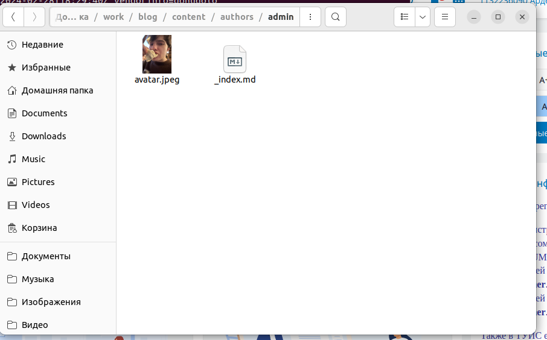
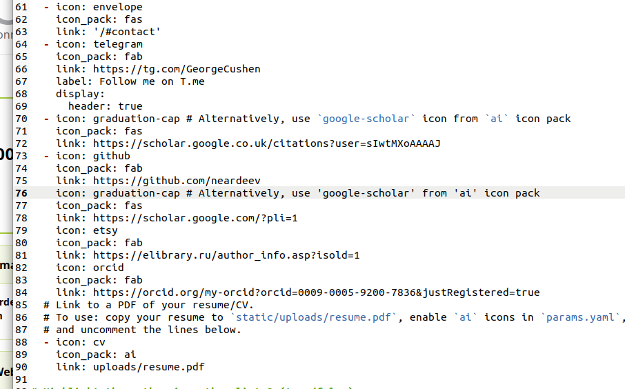
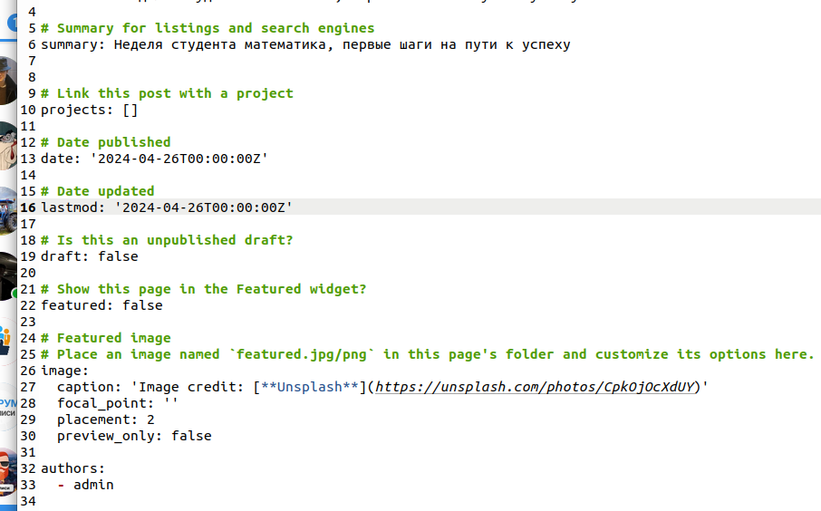
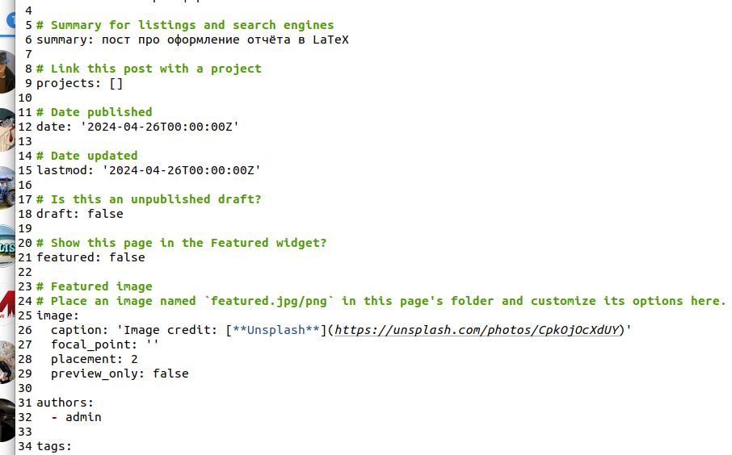

---
## Front matter
lang: ru-RU
title: Этап индивидуального проекта №4
subtitle: Операционные системы
author:
  - Ардеев Н. Е.
institute:
  - Российский университет дружбы народов, Москва, Россия

date: 29 апреля 2023

## i18n babel
babel-lang: russian
babel-otherlangs: english

## Formatting pdf
toc: false
toc-title: Содержание
slide_level: 2
aspectratio: 169
section-titles: true
theme: metropolis
header-includes:
 - \metroset{progressbar=frametitle,sectionpage=progressbar,numbering=fraction}
 - '\makeatletter'
 - '\beamer@ignorenonframefalse'
 - '\makeatother'
---

## Цель работы

Продолжить работы со своим сайтом. Редактировать его в соответствии с требованиями. Добавить данные о своих социальных сетях.

## Задание

Зарегистрироваться на соответствующих ресурсах и разместить на них ссылки на сайте:
        - eLibrary : https://elibrary.ru/;
        - Google Scholar : https://scholar.google.com/;
        - ORCID : https://orcid.org/;
        - Mendeley : https://www.mendeley.com/;
        - ResearchGate : https://www.researchgate.net/;
        - Academia.edu : https://www.academia.edu/;
        - arXiv : https://arxiv.org/;
        - github : https://github.com/.

## Задание

Сделать пост по прошедшей неделе.
Добавить пост на тему по выбору:
        - Оформление отчёта.
        - Создание презентаций.
        - Работа с библиографией.

## Теоретическое введение

Hugo — генератор статических страниц для интернета.

**Коротко: что такое статические сайты**
    1. Статические сайты состоят из уже готовых HTML-страниц.
    2. Эти страницы собираются заранее, а не готовятся для пользователя «на лету». Для этого используют генераторы статичных сайтов.
    3. Так как это почти чистый HTML, то такие сайты быстрее загружаются и их проще переносить с сервера на сервер.
    4. Минус: если нужно что-то обновить на странице, то сначала это правят в исходном файле, а потом запускают обновление в генераторе.
    5. Ещё минус: такие страницы не подходят для интернет-магазинов или сайтов с личным кабинетом, потому что в статике нельзя сформировать страницу для каждого отдельного пользователя.

## Выполнение лабораторной работы

Захожу в терминал, перехожу в директорию ~/work/blog, ввожу команду ~/bin/hugo server для запуска локального сервера

## Выполнение лабораторной работы

Перехожу в директорию ~/work/blog/content/authors/admin, открываю файл _index.md, в нем будет осуществляться дальнейшая работа

## Выполнение лабораторной работы

Вставляю ссылки и иконки на ресурсы по заданию

## Выполнение лабораторной работы

Добавил пост по прошедшей неделе в папке posts

## Выполнение лабораторной работы

Добавил пост на тему по выбору (оформление отчета) в папке posts

## Выполнение лабораторной работы

Проверяю, что все сделано корректно

## Выводы

В процессе выполнения второго этапа индивидуального проекта я научился редактировать данные о себе, а также писать посты и добавлять их на сайт.
